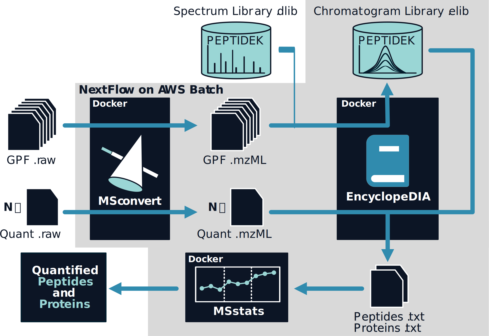

# NextFlow - EncyclopeDIA

This repository contains Talus' NextFlow pipeline for EncyclopeDIA. It connects three open-source tools---msconvert, EncylopeDIA, and MSstats---to go from raw mass spectrometry data to quantified peptides and proteins that are ready for statistical analysis. 

*We are still in the process of moving the containers used in this pipeline to open-source.*



## Dependencies
To run the pipeline locally, you'll need these dependencies:
- [NextFlow](https://www.nextflow.io/). Installing it with conda:

``` sh
conda install -c bioconda nextflow
```

- [Docker](https://www.docker.com/). Installing it with [Homebrew](https://brew.sh/) on a Mac:

``` sh
brew install docker
```


## Usage

The nf-encyclopedia pipeline can be launched in the same way as other NextFlow workflows:
``` sh
nextflow run /path/to/nf-encyclopedia --<parameters>
```

Where `<parameters>` are the pipeline parameters. The pipeline has 3 required parameters:

- `ms_file_csv` - A comma-separated values (CSV) file containing the raw mass spectrometry data files. It is required to have 3 columns: `file`, `chrlib`, and `group`.
  * `file` specifies the path of a raw MS data file.
  * `chrlib` is either `true` or `false` and specifies whether the file is part of a chromatogram library ("library files") or used for quantitation ("quant files"), respectively.
  * `group` specifies an experiment group. Quant files will searched only using library files from the same group. Any group with no library files will be searched directly with the DLIB instead. Additionally, the group will specify a subdirectory in which the pipeline results will be written. An example of such a file would be:
```
      file, chrlib, group
data/a.raw,   true,     x
data/b.raw,   true,     y
data/c.raw,  false,     x
data/d.raw,  false,     y
data/e.raw,  false,     z
```

- `encyclopedia.fasta` - The FASTA file of protein sequences for EncyclopeDIA to use. This must match the provided DLIB.

- `encyclopedia.dlib` - The spectral library for EncyclopeDIA to use, in the DLIB format.

Other important optional parameters are:

- `aggregate` is either `true` or `false` (default: `false`). When set to `true`, the pipeline will perform a single global EncyclopeDIA analysis encompassing all of the quant files. When set to `false`, a global EncyclopeDIA analysis is conducted for each experiment. 

## Development
### Running Tests
We use the [pytest](https://docs.pytest.org/en/7.0.x/contents.html) Python package to run our tests. It can be installed either with either pip:

```sh
pip install pytest
```

or conda:

``` sh
conda install pytest
```

Once installed, tests can be run from the root directory of the workflow. These tests use the process stubs to test the workflow logic, but do not test the commands for the tools themselves. Run them with:

``` sh
pytest
```
