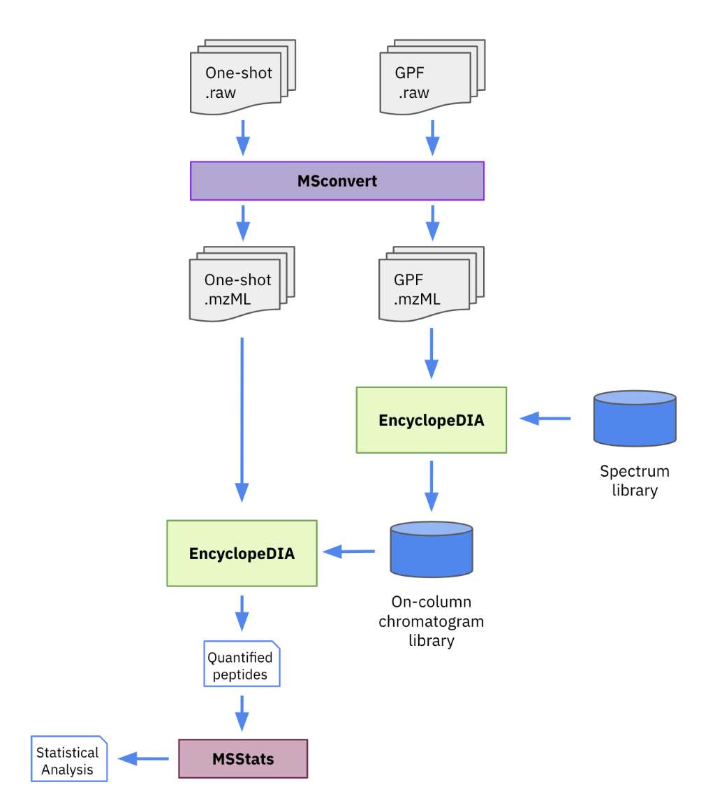

#  


## Introduction
This repository contains Talus' NextFlow pipeline for EncyclopeDIA. It connects three open-source tools---msconvert, EncylopeDIA, and MSstats---to go from raw mass spectrometry data to quantified peptides and proteins that are ready for statistical analysis. 


## Pipeline summary
1. Run msconvert
2. (Optionally) Build chromatogram library with EncyclopeDIA
3. Quantify peptides with EncyclopeDIA
4. (Optionally) Post-processing with MSStats




## Quick Start
To run the pipeline locally, you'll need these dependencies:
- [NextFlow](https://www.nextflow.io/) - Personally I install it using conda:

``` sh
conda install -c bioconda nextflow
```

- [Docker](https://www.docker.com/)[^1] - On my Mac, I install it with [Homebrew](https://brew.sh/)

``` sh
brew install docker
```

[^1]: Note that Docker is only required to really run the pipeline. Testing using NextFlow process stubs can be done without it.


## Documentation
Generally, we launch this pipeline from our [pipeline launcher](https://share.streamlit.io/talusbio/talus-pipeline-launcher/main/apps/pipeline_launcher.py). However, it can be launched like any other NextFlow pipeline locally:

``` sh
nextflow run /path/to/nf-encyclopedia --<parameters>
```

Where `<parameters>` are the pipeline parameters. The pipeline has 3 required parameters:

- `ms_file_csv` - A comma-separated values (CSV) file containing the raw mass spectrometry data files. It is required to have 3 columns: `file`, `chrlib`, and `group`.
  * `file` specifies the path of a raw MS data file.
  * `chrlib` is either `true` or `false` and specifies whether the file is part of a chromatogram library ("library files") or used for quantitation ("quant files"), respectively.
  * `group` specifies an experiment group. Quant files will searched only using library files from the same group. Any group with no library files will be searched directly with the DLIB instead. Additionally, the group will specify a subdirectory in which the pipeline results will be written. An example of such a file would be:
```
      file, chrlib, group
data/a.raw,   true,     x
data/b.raw,   true,     y
data/c.raw,  false,     x
data/d.raw,  false,     y
data/e.raw,  false,     z
```

- `encyclopedia.fasta` - The FASTA file of protein sequences for EncyclopeDIA to use. This must match the provided DLIB.

- `encyclopedia.dlib` - The spectral library for EncyclopeDIA to use, in the DLIB format.

Other important optional parameters are:

- `aggregate` is either `true` or `false` (default: `false`). When set to `true`, the pipeline will perform a single global EncyclopeDIA analysis encompassing all of the quant files. When set to `false`, a global EncyclopeDIA analysis is conducted for each experiment. 


## Development
### Running Tests
We use the [pytest](https://docs.pytest.org/en/7.0.x/contents.html) Python package to run our tests. It can be installed either with either pip:

```sh
pip install pytest
```

or conda:

``` sh
conda install pytest
```

Once installed, tests can be run from the root directory of the workflow. These tests use the process stubs to test the workflow logic, but do not test the commands for the tools themselves. Run them with:

``` sh
pytest
```

### Git Flow
We use git flow for features, releases, fixes, etc. Here's an introductory article: https://jeffkreeftmeijer.com/git-flow/.
And a cheatsheet: https://danielkummer.github.io/git-flow-cheatsheet/index.html.

### Releases
```
# See existing tags
git tag

# Create a new tag
git tag -a v0.0.1 -m "First version"

# Push to new tag
git push origin "v0.0.1"
```

## Known Issues
### Command `aws` cannot be found
Problem:
When creating the custom AMI, make sure to install the aws-cli outside of the /usr/ directory. During the docker mount it will overwrite it and render the docker image content unusable. 

Solution: 
Install the `aws` tool at `/home/ec2-user/bin/aws`:
```
# https://docs.aws.amazon.com/cli/latest/userguide/install-cliv2-linux.html
curl "https://awscli.amazonaws.com/awscli-exe-linux-x86_64.zip" -o "awscliv2.zip"
unzip awscliv2.zip
sudo ./aws/install -b /home/ec2-user/bin
aws --version
```

Also mentioned here: https://github.com/nextflow-io/nextflow/issues/2322

### Command 'ps' required by nextflow to collect task metrics cannot be found
Problem: 
Nextflow needs certain tools installed on the system to collect metrics: https://www.nextflow.io/docs/latest/tracing.html#tasks.

Solution:
Install `ps` in the docker image, e.g.
```
RUN apt-get update && \
    apt-get install procps -y && \
    apt-get clean
```

Also mentioned here:
https://github.com/replikation/What_the_Phage/issues/89


## Credits

nf-core/encyclopedia was originally written by Rico Meinl and Will Fondrie.

We thank the following people for their extensive assistance in the development of this pipeline:
- Brian Searle
- Seth Just


## Contributions and Support

If you would like to contribute to this pipeline, please see the [contributing guidelines](.github/CONTRIBUTING.md).

For further information or help, don't hesitate to get in touch on the [Slack `#encyclopedia` channel](https://nfcore.slack.com/channels/encyclopedia) (you can join with [this invite](https://nf-co.re/join/slack)).


## Citations

<!-- TODO nf-core: Add citation for pipeline after first release. Uncomment lines below and update Zenodo doi and badge at the top of this file. -->
<!-- If you use  nf-core/encyclopedia for your analysis, please cite it using the following doi: [10.5281/zenodo.XXXXXX](https://doi.org/10.5281/zenodo.XXXXXX) -->

<!-- TODO nf-core: Add bibliography of tools and data used in your pipeline -->

An extensive list of references for the tools used by the pipeline can be found in the [`CITATIONS.md`](CITATIONS.md) file.

You can cite the `nf-core` publication as follows:

> **The nf-core framework for community-curated bioinformatics pipelines.**
>
> Philip Ewels, Alexander Peltzer, Sven Fillinger, Harshil Patel, Johannes Alneberg, Andreas Wilm, Maxime Ulysse Garcia, Paolo Di Tommaso & Sven Nahnsen.
>
> _Nat Biotechnol._ 2020 Feb 13. doi: [10.1038/s41587-020-0439-x](https://dx.doi.org/10.1038/s41587-020-0439-x).
