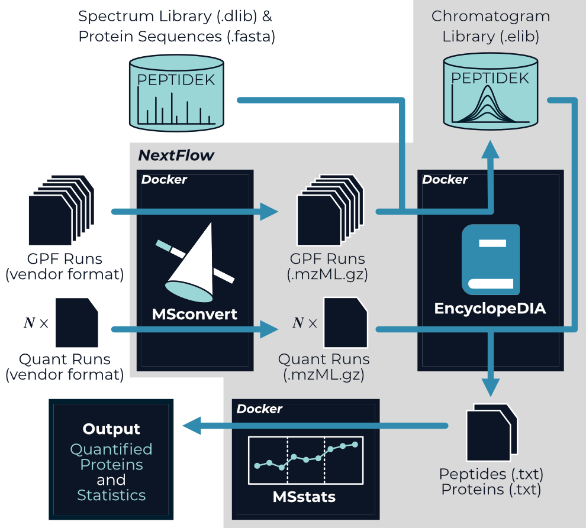

# A NextFlow pipeline for chromatogram library data-independent acquisition (DIA) proteomics workflows

nf-encyclopedia is a NextFlow pipeline specifically designed to analyze DIA proteomics experiment that leverage chromatogram libraries; however it is perfectly suited to analyze DIA proteomics experiments without chromatogram libraries as well. 
The nf-encyclopedia connects three open-source tools---MSconvert, EncyclopeDIA, and MSstats---to go from mass spectra to quantified peptides and proteins. 

{: style="width:500px"}

If you use nf-encyclopedia in your research, please [cite the pipeline and the tools it integrates](CITATION).

## Installation
We highly recommend using Docker when running nf-encyclopedia.
To do so, we first need to install three prerequisites on our system:

- [Docker desktop](https://www.docker.com/products/docker-desktop/)
- [Java 11+](https://www.java.com/en/)
- [NextFlow](https://www.nextflow.io/)

That's it! The nf-encyclopedia pipeline will be automatically downloaded when we launch it with NextFlow.

## Usage
To use nf-encyclopedia, we need to provide a list of mass spectrometry data files to analyze and indicate whether each should be part of a chromatogram library, is a comma-separated values format.
A minimal example of this input file would look like this (see the [Parameters](parameters) for additional details):
```title="input.csv"
file, chrlib
S01.raw, true
S02.raw, false
```

Additionally we need to provide a spectral library and a corresponding protein database in FASTA format. 
Libraries can be obtained from a variety of sources, including real libraries from MassIVE-KB, predicted libraries from Prosit, or from our own data-dependent acquisition data; however, often these will need to be converted to EncyclopeDIA's DLIB format using EncyclopeDIA itself (see the EncyclopeDIA user guide for details). 
We will call these files `proteins.dlib` and `proteins.fasta`.

With these files present on our machine, we then open our terminal (command line) and navigate to the directory in which we want to conduct our analysis.
We can then launch the nf-encyclopedia pipeline:[^1]

[^1]: Note that you will likely need to set the `--max_cpus`, `--max_memory` to match your system as well. See [Resource Parameters](parameters/#resource-parameters) for details.


```
nextflow run TalusBio/nf-encyclopedia -r latest --input input.csv --dlib proteins.dlib --fasta proteins.fasta
```

### Using a configuration file
Alternatively, we can put these parameters and others in a NextFlow configuration file:
```title="pipeline.config"
params {
    input = 'input.csv'
    dlib  = 'proteins.dlib'
    fasta = 'proteins.fasta'
}
```

With this configuration file saved, we can instead launch our pipeline with:

```
nextflow run TalusBio/nf-encyclopedia -r latest -c pipeline.config
```

## Outputs
The outputs from the nf-encyclopedia pipeline are the quantified peptides and proteins from each non-library file:

- `encyclopedia.quant.peptides.txt` - The measured peptide abundance in each mass spectrometry data file from EncyclopeDIA.
- `encyclopedia.quant.proteins.txt` - The measured protein abundance in each mass spectrometry data file from EncyclopeDIA.

If MSstats was enabled:

- `msstats.proteins.txt` - The model-based protein abundance estimates from MSstats.
- `msstats.stats.txt` - Differential expression statistics (p-values, etc.) from MSstats. 
  This file will only exist if a contrast matrix is provided.

## Resources

Here are additional resources to check out:

- [The NextFlow documentation](https://www.nextflow.io/docs/latest/index.html) - See the NextFlow documentation to learn how to move beyond your local machine and more!
- [nf-core](https://nf-co.re/) - Community developed NextFlow pipelines, along with excellent training and resources.
- [NextFlow Tower](https://tower.nf/) - Launch and monitor NextFlow pipelines using this web interface.
